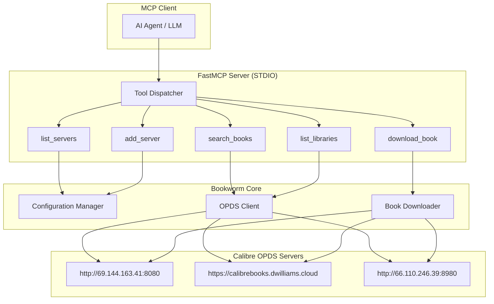

# FastMCP OPDS Book Search & Download Server - MVP Plan

## Overview

Create a FastMCP server (STDIO transport) that enables AI agents to search Calibre OPDS book servers and download ebooks. The server will support multiple OPDS endpoints and provide tools for discovery, search, and content retrieval.

---

## System Architecture



---

## Core Components

### 1. OPDS Client Module

**Purpose:** Handle all HTTP communication with Calibre OPDS servers.

**Key Endpoints:**
| Endpoint | Purpose | Example |
|----------|---------|---------|
| `/opds` | Library catalog discovery | `/opds?library_id=books` |
| `/opds/search/{query}` | Search endpoint | `/opds/search/indiana%20jones?library_id=books` |
| `/mobile` | Mobile search interface (HTML) | `/mobile?search=indiana+jones&library_id=books` |
| `/interface-data/books-init` | JSON metadata API | `/interface-data/books-init?library_id=books&search=indiana+jones` |
| `/legacy/get/{format}/{id}/{library}` | Book download | `/legacy/get/EPUB/94036/books/book.epub` |

**Data Structures:**
```python
@dataclass
class Book:
    id: int
    title: str
    authors: List[str]
    formats: List[str]  # EPUB, PDF, CBR, etc.
    library_id: str
    server_url: str
    cover_url: Optional[str]
    description: Optional[str]
    series: Optional[str]
    tags: List[str]
    pubdate: Optional[str]
    size_bytes: Optional[int]

@dataclass
class Library:
    id: str
    name: str
    server_url: str

@dataclass
class Server:
    url: str
    libraries: List[Library]
```

### 2. Configuration Module

**Purpose:** Manage configured OPDS servers and preferences.

**Configuration File (`config.json`):**
```json
{
  "opds_servers": [
    "http://69.144.163.41:8080/opds",
    "https://calibrebooks.dwilliams.cloud/opds",
    "http://66.110.246.39:8980/opds"
  ],
  "default_server": "http://69.144.163.41:8080/opds",
  "download_format_preference": ["EPUB", "PDF", "CBR", "CBZ"],
  "download_directory": "./downloads"
}
```

### 3. FastMCP Server

**Purpose:** Expose tools to MCP clients via STDIO transport.

**Tool Definitions:**

#### `list_servers`
List all configured OPDS servers.
- **Returns:** Formatted string with server list and default marker

#### `add_server(url: str, set_default: bool = False)`
Add a new OPDS server to configuration.
- **Parameters:**
  - `url`: OPDS endpoint URL (e.g., `http://example.com:8080/opds`)
  - `set_default`: Whether to set as default server
- **Returns:** Confirmation message

#### `remove_server(url: str)`
Remove an OPDS server from configuration.
- **Parameters:**
  - `url`: Server URL to remove
- **Returns:** Confirmation message

#### `list_libraries`
List all libraries available on specified or default server.
- **Parameters:**
  - `target`: Optional server URL override
- **Returns:** List of library names with IDs

#### `search_books(query: str, target: Optional[str] = None, library_id: Optional[str] = None, num: int = 25, sort: str = "timestamp", order: str = "descending")`
Search for books across configured servers.
- **Parameters:**
  - `query`: Search keywords (URL encoded)
  - `target`: Optional server URL override
  - `library_id`: Specific library to search
  - `num`: Number of results (default 25)
  - `sort`: Sort field (timestamp, title, author, size, rating, series, tags)
  - `order`: Sort order (ascending, descending)
- **Returns:** List of Book objects with metadata

#### `get_book_details(book_id: int, target: str, library_id: str)`
Get detailed metadata for a specific book.
- **Parameters:**
  - `book_id`: Book identifier
  - `target`: Server URL
  - `library_id`: Library identifier
- **Returns:** Full book metadata including all formats

#### `download_book(book_id: int, format: str, target: str, library_id: str, output_path: Optional[str] = None)`
Download a book in specified format.
- **Parameters:**
  - `book_id`: Book identifier
  - `format`: File format (EPUB, PDF, CBR, CBZ, etc.)
  - `target`: Server URL
  - `library_id`: Library identifier
  - `output_path`: Optional custom save path
- **Returns:** Download status and file path

---

## Project Structure

```
bookworm-opds/
├── pyproject.toml
├── README.md
├── .env.example
├── bookworm_opds/
│   ├── __init__.py
│   ├── server.py          # FastMCP server entry point
│   ├── config.py          # Configuration management
│   ├── opds_client.py     # OPDS HTTP client
│   ├── models.py          # Data classes
│   ├── downloader.py      # Book download logic
│   └── tools/
│       ├── __init__.py
│       ├── server_tools.py    # list_servers, add_server, etc.
│       ├── search_tools.py    # search_books, get_book_details
│       └── download_tools.py  # download_book
├── tests/
│   ├── __init__.py
│   ├── test_opds_client.py
│   ├── test_tools.py
│   └── test_downloader.py
└── plans/
    └── implementation-guide.md
```

---

## Implementation Details

### OPDS Client Implementation Notes

1. **Library Discovery:** Parse OPDS XML to extract library IDs from `<title>Library: {name}</title>` elements

2. **Search Implementation:**
   - Use `/interface-data/books-init` endpoint for JSON responses
   - URL encode search queries: `indiana jones` → `indiana%20jones`
   - Parse response for `metadata` and `book_ids` fields

3. **Download Logic:**
   - Construct download URL: `{server}/legacy/get/{format}/{book_id}/{library_id}/{title}.{ext}`
   - Handle HTTP redirects
   - Validate file format matches request

### Error Handling

| Error Type | Handling Strategy |
|------------|-------------------|
| Network timeout | Retry with exponential backoff (max 3 attempts) |
| Invalid library ID | Return clear error with available libraries |
| Format not available | List available formats for book |
| Server unavailable | Continue searching other configured servers |

---

## MCP Tool Specifications

### Tool Schema (JSON-RPC Style)

```json
{
  "search_books": {
    "description": "Search for books across configured OPDS servers",
    "parameters": {
      "type": "object",
      "properties": {
        "query": {"type": "string", "description": "Search keywords"},
        "target": {"type": "string", "description": "Specific server URL"},
        "library_id": {"type": "string", "description": "Library to search"},
        "num": {"type": "integer", "default": 25},
        "sort": {"type": "string", "enum": ["timestamp", "title", "author", "size", "rating", "series", "tags"]},
        "order": {"type": "string", "enum": ["ascending", "descending"]}
      },
      "required": ["query"]
    }
  },
  "download_book": {
    "description": "Download a book in specified format",
    "parameters": {
      "type": "object",
      "properties": {
        "book_id": {"type": "integer"},
        "format": {"type": "string", "enum": ["EPUB", "PDF", "CBR", "CBZ", "MOBI", "AZW3"]},
        "target": {"type": "string"},
        "library_id": {"type": "string"},
        "output_path": {"type": "string"}
      },
      "required": ["book_id", "format", "target", "library_id"]
    }
  }
}
```

---

## User Journey Example

```
1. User adds OPDS servers
   → add_server("http://69.144.163.41:8080/opds", set_default=true)

2. User searches for books
   → search_books("indiana jones", num=10, sort="timestamp", order="descending")
   → Returns list of 19 books with metadata

3. User gets book details
   → get_book_details(book_id=94036, target="http://69.144.163.41:8080", library_id="books")
   → Returns full metadata including available formats: [CBR]

4. User downloads book
   → download_book(book_id=94036, format="CBR", target="http://69.144.163.41:8080", library_id="books")
   → Returns path: "./downloads/Indiana_Jones_Colouring_Set.cbr"
```

---

## Testing Strategy

### Unit Tests
- OPDS XML parsing for library discovery
- Search query URL encoding
- Download URL construction
- Configuration persistence

### Integration Tests
- Connect to test OPDS servers
- Search across multiple servers
- Download sample books
- Handle network failures

### MCP Protocol Tests
- Tool invocation via STDIO
- JSON-RPC message formatting
- Error response handling

---

## MVP Scope

**In Scope:**
1. Configure OPDS servers (add/list/remove)
2. Discover libraries on servers
3. Search books by keywords
4. Get book metadata
5. Download books in supported formats
6. Basic error handling

**Out of Scope (Future):**
1. Full OPDS 2.0 catalog navigation
2. Authentication/authorization
3. Book parsing and content extraction
4. Batch downloads
5. Cover image retrieval
6. Advanced search filters

---

## Implementation Checklist

- [ ] Set up project structure with pyproject.toml
- [ ] Implement configuration module (config.py)
- [ ] Implement OPDS client with XML/JSON parsing
- [ ] Implement book downloader
- [ ] Create FastMCP server with all tools
- [ ] Add error handling and logging
- [ ] Write unit tests
- [ ] Write integration tests
- [ ] Create README with usage examples
- [ ] Test with provided OPDS servers

---

## Dependencies

```toml
[project]
name = "bookworm-opds"
version = "0.1.0"
requires-python = ">=3.10"
dependencies = [
    "fastmcp>=1.0.0",
    "httpx>=0.24.0",
    "pydantic>=2.0.0",
    "python-dotenv>=1.0.0",
]

[project.optional-dependencies]
dev = [
    "pytest>=7.0.0",
    "pytest-asyncio>=0.21.0",
    "httpx>=0.24.0",
]
```

---

## Notes for Implementation

1. **URL Encoding:** Use `urllib.parse.quote()` for search queries
2. **Library ID Extraction:** Parse from OPDS XML `<title>Library: {id}</title>`
3. **Download URL Pattern:** `{base}/legacy/get/{format}/{id}/{library_id}/{title}.{ext}`
4. **Format Preference:** Try EPUB first, fallback to other available formats
5. **Error Messages:** Return user-friendly messages for MCP client display
